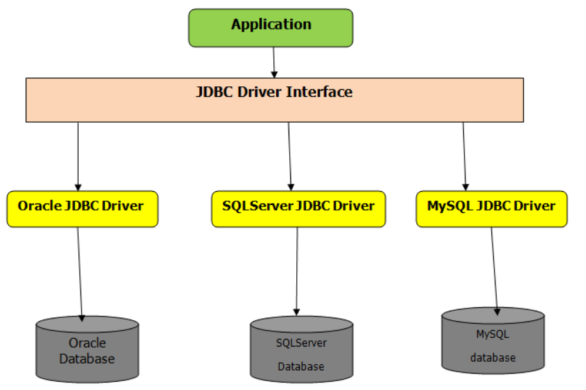
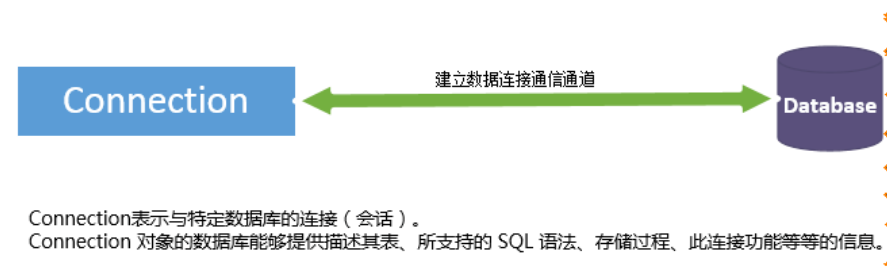
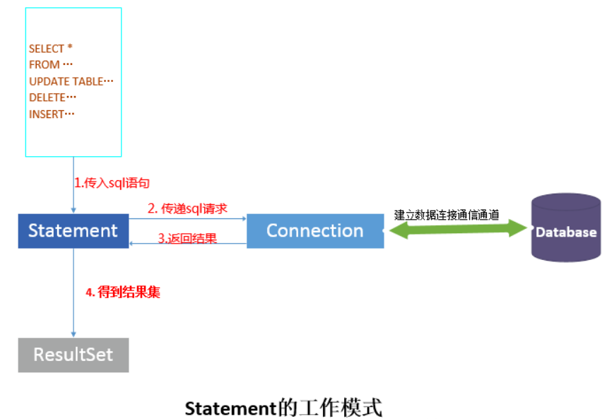
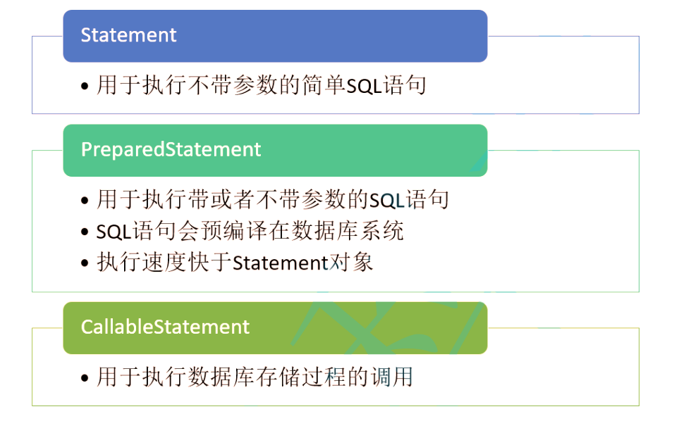
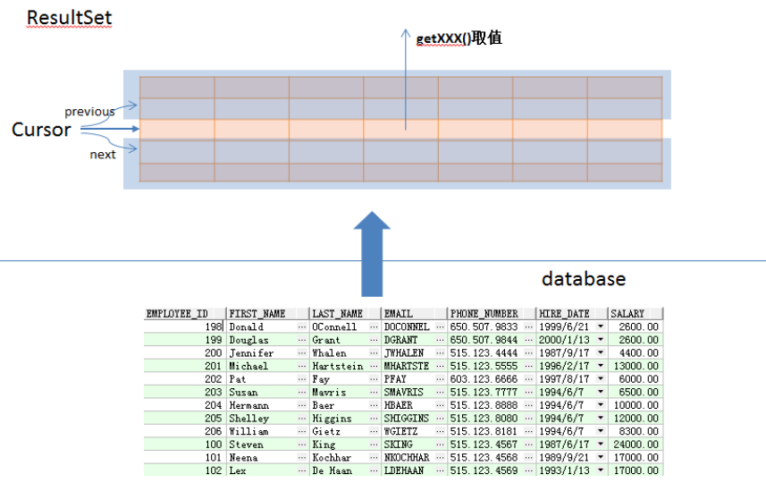

### JDBC结构

JDBC（Java DataBase Connectivity,java数据库连接）是一种用于**执行SQL语句的Java API**，可以为多种关系数据库提供统一访问，它由一组用Java语言编写的类和接口组成。
<!--more-->
一般情况下，在应用程序中进行数据库连接，调用JDBC接口，首先要将特定厂商的**JDBC驱动实现加载到系统内存**中，然后供系统使用。基本结构图如下：



JDBC包含以下几大角色 : Driver、DriverManager、Connection、Statement、ResultSet。这几大角色之间的层次关系如下图所示：


- Connection：Driver 或者 DriverManager根据连接的url 和参数信息创建Connection实例，用来维持和数据库的数据通信，如果没有销毁或者调用close()对象，此对象和数据库的对象会一直保持连接；
- Statement：Connection创建Statement对象，表示需要执行的sql语句或者存储过程；
- ResultSet： 表示Statement执行完SQL语句后返回的结果集。

### JDBC常用接口和类

#### JDBC API

在Java JDBC编程中对数据库的操作均使用JDK自带的API统一处理，通常与特定数据库的驱动类是完全解耦的。所以掌握Java JDBC API （位于 java.sql 包下） 即可掌握Java数据库编程.

#### 数据库连接Connection

Connection表示与特定数据库的连接，可以获取到数据库的一些信息，这些信息包括：其表信息，应该支持的SQL语法，数据库内有什么存储过程，此链接功能的信息等等。



Connection接口实现类由数据库提供，获取Connection对象通常有两种方式:

- 通过DriverManager（驱动管理类）的静态方法获取.

```java
// 加载JDBC驱动程序
Class.forName("com.mysql.jdbc.Driver");
// 创建数据库连接
Connection connection = DriverManager.getConnection(url);
```

- 通过DataSource（数据源）对象获取。实际应用中会使用DataSource对象.

```java
DataSource ds = new MysqlDataSource();
((MysqlDataSource) ds).setUrl("jdbc:mysql://localhost:3306/test");
((MysqlDataSource) ds).setUser("root");
((MysqlDataSource) ds).setPassword("root");
Connection connection = ds.getConnection();
```

两种不同方式创建的区别：
  1.DriverManager类来获取的Connection连接，是**无法重复利用**的，每次使用完以后释放资源时，都是**关闭物理连接**connection.close().
  2.DataSource提供**连接池**的支持。连接池在初始化时将创建一定数量的数据库连接，这些连接是**可以复用**的，每次使用完数据库连接，释放资源调用connection.close()都是将Conncetion连接对象回收.

#### Statement对象

Statement 的功能在于根据传入的sql语句，将传入sql经过整理组合成数据库能够识别的sql语句(对于静态的sql语句，不需要整理组合；而对于预编译sql语句和批量语句，则需要整理)，然后传递sql请求，之后会得到返回的结果。对于查询sql，结果会以ResultSet的形式返回.



Statement对象主要是将SQL语句发送到数据库中。JDBC API中主要提供了三种Statement对象.



掌握两种执行SQL的方法：

对**查询类型的sql语句**的执行方法

- executeQuery() 方法执行后返回单个结果集的，通常用于select语句

```java
executeQuery(String sql);
    执行给定的 SQL 语句，该语句返回单个 ResultSet 对象。
```

对**更新类的sql语句**的执行方法

- executeUpdate()方法返回值是一个整数，指示受影响的行数，通常用于update、insert、delete语句

#### ResultSet对象

当Statement查询sql执行后，会得到ResultSet对象，ResultSet对象是sql语句查询的结果，作为数据库结果的映射，其映射关系如下图所示。



ResultSet对象它被称为结果集，它代表符合SQL语句条件的所有行，并且它通过一套getXXX方法提供了对这些行中数据的访问.
ResultSet里的数据一行一行排列，每行有多个字段，并且有一个记录指针，指针所指的数据行叫做当前数据行，我们只能来**操作当前的数据行**。我们如果想要**取得某一条记录**，就要使用ResultSet的**next()方法 **,如果我们想要得到ResultSet里的**所有记录**，就应该使用**while循环**.

### JDBC使用步骤

1. 创建数据库连接Connection
DriverManager创建
DataSource获取
2. 创建操作命令Statement
PreparedStatement
3. 使用操作命令来执行SQL

    ```java
    // 查询操作
    preparedStatement.executeQuery();
    // 新增、修改、删除操作
    preparedStatement.executeUpdate();
    ```

4. 处理结果集ResultSet

    ```java
    while (resultSet.next()) {
    int xxx = resultSet.getInt("xxx");
    String yyy= resultSet.getString("yyy");
    ...
    }
    ```

5. 释放资源

    ```java
    try {
        if(resultSet != null){
        resultSet.close();
        }
        if(preparedStatement != null){
        preparedStatement.close();
        }
        if(connection != null){
        connection.close();
        }
        } catch (SQLException e) {
        e.printStackTrace();
        throw new RuntimeException("数据库错误");
    }
    ```

### JDBC优势

- Java语言访问数据库操作完全面向抽象接口编程
- 开发数据库应用不用限定在特定数据库厂商的API
- 程序的可移植性大大增强.
